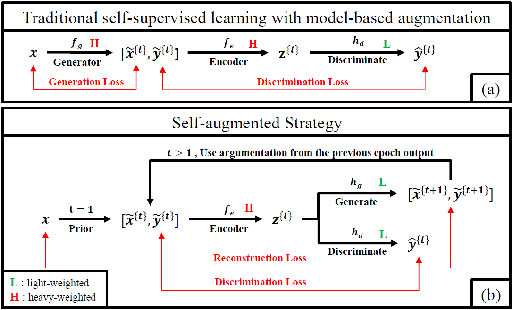

# SAS: Self-Augmentation Strategy for Language Model Pre-training

This repository contains the official pytorch implementation for the paper "SAS: Self-Augmentation Strategy for Language Model Pre-training" based on Huggingface transformers version 4.3.0.

Only the SAS without the disentangled attention mechanism is released for now. To be updated.



## File structure 

- `train.py`: The file for pre-training. 
- `run_glue.py`: The file for finetuning.
- `models`
    - `modeling_sas.py`: The main algorithm for the SAS. 
    - `trainer_sas.py`: It is inherited from Huggingface transformers. It is mainly modified for data processing. 
- `utils`: It includes all the utilities. 
    - `data_collator_sas.py`: It includes the details about self-augmentations.
- The rest of codes are supportive. 

## How to 

### Download and Install 

- Clone this repository. 
- Download dataset for wiki-corpus. Store it to data folder. Currently, we only provide a trail data with 1 million sentence. Full dataset can be pre-processed according to BERT. Detail to be released.
<!-- - (Optional) If you want to use pretrained model, download checkpoints and store it to checkpoint folder.  -->
- (Optional) Create an environment through conda by the provided environment.yml
    - You can also manually install the package:
        - Python==3.9, pytorch==1.10.0, transformers==4.3.0, etc.
<!-- - (Optional)  -->

```{bash}
    # Clone package
    git clone git@github.com:fei960922/SAS-Self-Augmentation-Strategy.git
    cd SAS-Self-Augmentation-Strategy

    # Establish the environment.
    conda env create -f environment.yml 
    conda activate cssl

    # Download dataset and checkpoint
    wget http://www.stat.ucla.edu/~yifeixu/sas/wiki_corpus_1M.npy
```

### Train from stractch 

```{bash}
    # Run default setting 
    bash script/pretrain.sh

    # Run custom setting
    python train.py

    # Starting from checkpoint 
    python train.py --start_from_checkpoint 1 --pretrain_path {PATH_TH_CHECKPOINT}
```

### Caclulate GLUE scores 

```{bash}
    # By running this bash, GLUE dataset will be automatically downloaded.
    bash finetune.sh MNLI 0 sas-base output_dir 5e-5 32 4 42
    bash finetune.sh MNLI 0 sas-small output_dir 1e-4 32 4 42
```

### GLUE Scores(Dev)

| Model | MNLI | QQP | QNLI | SST2 | CoLA | STSB | MRPC | RTE |
| :-----| :-----| ----: | :----: | :----: | :----: | :----: | :----: | :----: |
| SAS_small | 81.82 | 90.14 | 89.21 | 90.13 | 61.33 | 87.55 | 87.25 | 66.06 |